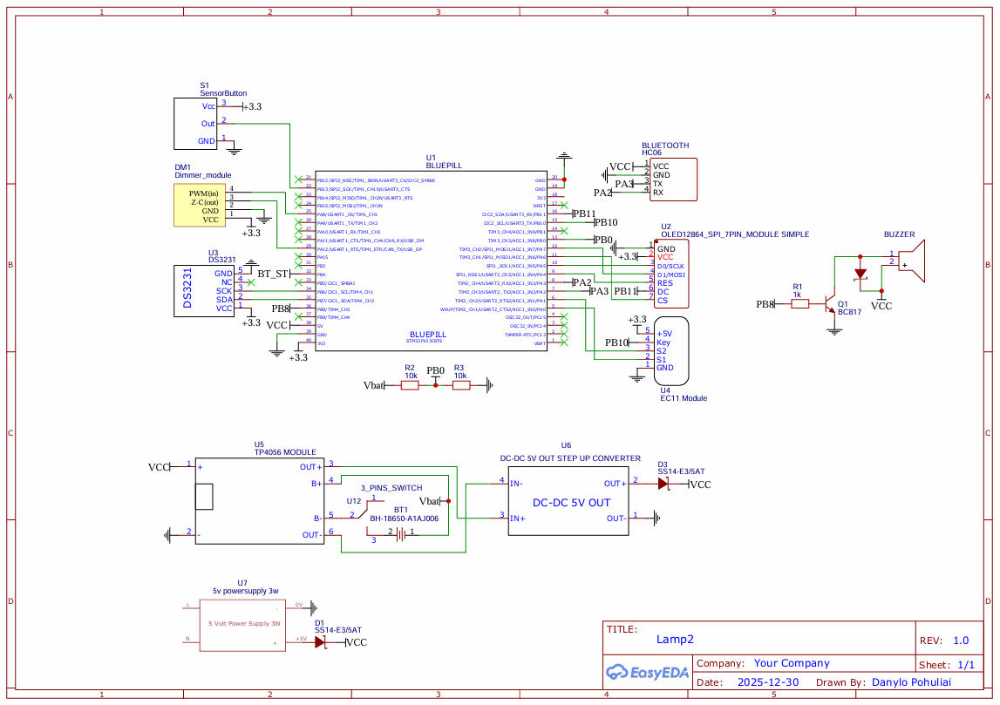

# Smart Lamp 2.0: STM32 FreeRTOS Edition

   

**Development Timeline:** December 30, 2025 – January 06, 2026

## Project Overview

This project represents a significant evolution of the original *Smart Lamp (2020)*. Moving away from the ATmega328P, this iteration leverages the power of the **STM32F103 (Blue Pill)** 32-bit microcontroller and **FreeRTOS** to create a highly responsive, multitasking-capable smart device.

The primary goal was to achieve instant responsiveness across all peripherals—display, audio, dimming, and wireless communication—without the blocking delays inherent in the previous architecture.

---

## Key Features

* **AC Dimming Control:** Hardware-based phase control dimming using Timers synchronized with Zero-Cross detection for flicker-free lighting.
* **OLED User Interface:** Fluid 10 FPS menu system running on an SSD1306 display via hardware SPI.
* **Smart Alarm Clock:** Integrated DS3231 RTC with multiple alarm settings and custom melody playlists.
* **High-Fidelity Audio:** PWM-based melody player with a dedicated transistor driver, featuring progressive volume fade-in for a gentle wake-up experience.
* **Wireless Control:** Full control via Bluetooth (HC-06) using DMA for zero-CPU-load transmission. Includes an "Auto-Greeting" feature upon connection.
* **UPS & Power Management:** Integrated 5V Power Supply, TP4056 charging logic, and real-time battery voltage monitoring via a resistive voltage divider.
* **Smart Flash Storage:** Custom wear-leveling algorithm to extend the lifespan of the microcontroller's internal memory.

---

## Technical Architecture

The core strength of this project lies in its utilization of **FreeRTOS** and the STM32's **Direct Memory Access (DMA)** and **Hardware Timers**. The system is divided into isolated threads (Tasks) to ensure critical operations (like dimming and audio) never stutter.

### FreeRTOS Task Configuration

| Task Name | Priority | Stack Size | Description |
| :--- | :--- | :--- | :--- |
| **Music Task** | `High` | 128 | Highest priority to ensure note timing is perfect. Handles PWM generation and volume fading. |
| **Input Task** | `AboveNormal` | 128 | Reads the Encoder (via TIM2 hardware counter) and debounces the Sensor Button. |
| **GUI Task** | `Normal` | 256 | Manages OLED rendering and menu state logic. |
| **Alarm Task** | `Normal` | 128 | Background task that polls the RTC, triggers alarms, and monitors battery voltage. |
| **Comm Task** | `Low` | 600 | Manages Bluetooth parsing and "Connection Detection" logic. Large stack to handle RX buffers. |

### Smart Flash Storage (Wear Leveling)

Standard Flash memory has a limited number of erase cycles. Instead of erasing a whole page every time a setting is changed, this project implements a **Linear Append Algorithm**:

1.  **Append Strategy:** When saving settings (Alarm times, Playlist, Preferences), the system looks for the next empty "slot" (`0xFF`) in the designated Flash Page.
2.  **Sequential Writing:** New data is written to the next available address, leaving old data untouched but marked as obsolete by the presence of new data.
3.  **Lazy Erase:** The expensive "Page Erase" operation is only performed when the entire page is full.
4.  **Result:** This increases the memory lifespan by a factor of **~32x** compared to standard read-modify-write methods.

---

## Control Interfaces

The device offers a dual-interface system: a physical tactile interface and a wireless CLI (Command Line Interface).

### 1. Physical Controls
The device uses a Rotary Encoder and a Capacitive Sensor Button.

* **Rotary Encoder (Rotate):** Adjust brightness (Main Screen) or Navigate items (Menu).
* **Rotary Encoder (Click):** Select option / Toggle Light / Enter Sub-menu.
* **Sensor Button (Click):** Stop Music / Back / Enter Settings.
* **Sensor Button (Long Press):** Shortcut to specific settings.

### 2. Bluetooth Terminal Commands
The device communicates via UART (115200 baud). Below is the full list of supported commands:

| Command | Arguments | Description | Example |
| :--- | :--- | :--- | :--- |
| `b` | `<0-100>` | Set Brightness level | `b50` |
| `v` | `<0-100>` | Set Music Volume | `v30` |
| `t` | `<HHMMSS>` | Sync System Time | `t153000` |
| `t` | `<H:M:S>` | Sync System Time (Format 2) | `t9:30:0` |
| `d` | `<D.M.Y>` | Set System Date | `d 1.1.26` |
| `a` | *None* | List all active alarms | `a` |
| `a` | `<ID><HHMM>` | Set or Edit an Alarm | `a00730` |
| `o` | `<ID>` | Toggle Alarm ON/OFF | `o0` |
| `del`| `<ID>` | Delete an Alarm | `del0` |
| `m` | *None* | List Melodies & Playlist status | `m` |
| `m` | `<ID>` | Play specific melody (or Stop) | `m1` |
| `r` | *None* | Soft System Reset | `r` |

> **Note:** The `CommTask` includes logic to detect the rising edge of the Bluetooth module's STATE pin. When a phone connects, the lamp automatically sends a greeting and status report.

---

## Hardware Components

The schematic is built around the **STM32F103C8T6** but includes several critical peripherals:

1.  **Power & UPS:**
    * **5V Power Supply Module (3W):** Main AC/DC conversion.
    * **TP4056:** Lithium-Ion battery charging management.
    * **Voltage Divider:** Connected to ADC for battery level monitoring.
    * **DC-DC Boost:** Stabilizes 5V for the Blue Pill when running on battery.
2.  **User Interface:**
    * **SSD1306 OLED (0.96"):** 7-pin SPI interface for high-speed updates.
    * **EC11 Encoder:** Hardware filtered via Timer 2.
    * **Touch Sensor:** TTP223 or similar capacitive sensor.
3.  **Audio:**
    * **Passive Buzzer:** Driven by a **BC817 Transistor** (configured as a switch) to handle PWM currents higher than GPIO limits.
4.  **Timekeeping:**
    * **DS3231:** High-precision I2C RTC with coin-cell backup.
5.  **Connectivity:**
    * **HC-06 Bluetooth:** Connected via USART2 with DMA enabled.
6.  **Light Control:**
    * **AC Dimmer Module:** [Custom-designed PCB](https://oshwlab.com/danylo.pohuliai/dimm) featuring Zero-Cross detection and Triac control.

*Click the image above to open the full PDF schematic.*

---

## Evolution from v1.0

| Feature | Old Version (ATmega328P) | New Version (STM32 + FreeRTOS) |
| :--- | :--- | :--- |
| **Multitasking** | Cooperative (Blocking) | **Preemptive (FreeRTOS)** |
| **Storage** | EEPROM (limited cycles) | **Flash with Wear-Leveling** |
| **Audio** | Single tone `delay()` | **Polyphonic-style PWM Task** |
| **Dimming** | Software Interrupts | **Hardware Timer PWM** |
| **Speed** | 16 MHz | **72 MHz** |

---

### Author

**Danylo Pohuliai**
*Project Completed: January 6, 2026*